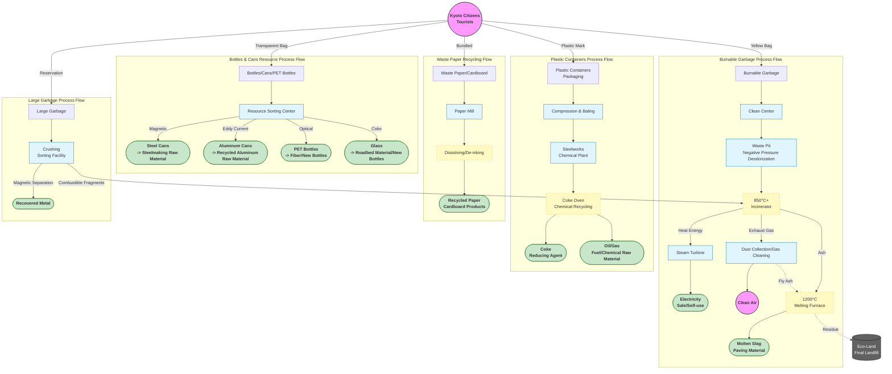

When we throw a garbage bag into the collection point, it doesn't just "disappear"; it enters an industrial cycle system composed of precision machinery, chemical processes, and strict environmental standards.

To realize a "Sound Material-Cycle Society," Kyoto City employs a series of high-tech means to treat waste. Here is a hardcore breakdown of the treatment processes for various types of garbage.

## Kyoto Waste Treatment Process Flowchart

---

## Burnable Garbage: From Incineration to "Melting Resource Recovery"

Kyoto City's Clean Centers (such as the Southern and Northeastern Clean Centers) do not just "burn" garbage; they are actually **thermal power plants** and **mineral manufacturing plants**.

### Step 1: Negative Pressure and Deodorization

Garbage trucks unload waste into a huge **Waste Pit**. To prevent odors from escaping, the inside of the waste pit is kept under **negative pressure**, and the extracted odorous air is sent directly into the incinerator to be completely decomposed at high temperatures.

### Step 2: 850°C+ High-Temperature Complete Combustion

Huge cranes grab the garbage and feed it into the **Stoker-type Incinerator**.

* **Temperature Control:** The temperature inside the furnace is strictly controlled between **850°C ~ 950°C**.
* **Purpose:** This temperature range maximizes the suppression of the generation of the highly toxic substance **dioxin**.
* **Waste Heat Utilization:** The heat energy generated by combustion heats water into high-pressure steam, which drives a steam turbine to generate electricity. The annual power generation of Kyoto City's Clean Centers can supply tens of thousands of households.

### Step 3: Exhaust Gas Purification (Gas Cleaning)

The flue gas after combustion is extremely turbid and must undergo multiple filtrations:

* **Bag Filter:** Adsorbs fine dust like a giant vacuum cleaner.
* **Gas Cleaning Tower:** Sprays lime slurry and activated carbon to neutralize acidic gases and adsorb residual heavy metals.

### Step 4: Ash into "Gems" (Melting Furnace)

This is the most critical step. The **bottom ash** remaining after combustion and the **fly ash** filtered out are sent to the **Melting Furnace**.

* **1200°C Ultra-High Temperature:** At extremely high temperatures, the ash is melted into a magma-like liquid.
* **Water Cooling Solidification:** The liquid flows into water and cools instantly, turning into granules like black glass sand, called **Molten Slag**.
* **Usage:** The volume of this molten slag is only 1/2 of the ash, and it is very strong and non-toxic. It is widely used for **paving materials, asphalt mixtures**, and **concrete aggregates**.

---

## Bottles, Cans, PET Bottles: The Ultimate Application of Physical Laws

The Resource Waste Treatment Center is like a giant "physics laboratory," using magnetic force, wind force, and optics for automatic sorting.

### Step 1: Bag Breaking and Impurity Removal

First, machine blades cut open the garbage bags, and a **Wind Sorter** blows away mixed plastic bags and light paper scraps. A manual assembly line removes non-recyclable foreign objects (such as lithium batteries and lighters).

### Step 2: Magnetic Separator

Using powerful magnets, **steel cans** are instantly sucked up and separated from other items on the conveyor belt.

### Step 3: Aluminum Separator (Eddy Current Separator)

This is a black technology utilizing the **Eddy Current** principle.

* The machine generates a high-frequency changing magnetic field.
* When **aluminum cans** pass through, eddy currents are generated on the aluminum surface, which in turn produces a repulsive magnetic field.
* The aluminum cans are "flicked away" from the conveyor belt into a dedicated recycling bin.

### Step 4: Optical Sorting (For PET Bottles)

* **Near-Infrared Sensors** scan the material of the bottles on the conveyor belt.
* Once PET material is identified, a **high-pressure air nozzle** at the end of the machine precisely sprays a jet of air to blow the PET bottle into the recycling channel, while other plastic bottles fall naturally.

---

## Plastics: Moving Towards "Chemical Recycling"

Plastic containers and packaging collected in Kyoto City, after being compressed and baled, are mainly treated through **Chemical Recycling** technology, which is a relatively advanced treatment method in Japan.

### Core Technology: Coke Oven Chemical Feedstock Recycling

Many plastics are sent to steelworks (such as Nippon Steel & Sumitomo Metal, etc.).

* **Raw Material Input:** Waste plastics are shredded and fed into **Coke Ovens** used for steelmaking.
* **Anaerobic Pyrolysis:** Heated in an oxygen-free environment.
* **Products:**
1. **Coke (40%):** Used as a reducing agent for steelmaking.
2. **Oil (40%):** Becomes chemical raw material oil.
3. **Coke Oven Gas (20%):** Used as fuel for power generation.

* **Significance:** This method replaces the coal resources originally needed with waste plastics, achieving carbon emission reduction.

---

## Final Disposal Site (Landfill): Not the End, But a "Capsule"

All residues that cannot be recycled or burned, as well as some incineration ash, eventually come to Kyoto City's **Eco-Land Otowa** (located in Fushimi Ward).

This is not simply digging a hole and burying it, but a huge **environmental isolation capsule**.

* **Sandwich Structure:** Uses a "garbage layer + soil cover layer" alternating burial method to prevent garbage scattering and bad odors.
* **Impermeable Layer:** The bottom is lined with multiple layers of high-strength **waterproof sheets** to prevent dirty water from seeping into groundwater and soil.
* **Leachate Treatment:** Sewage (leachate) generated in the landfill is collected through pipes and sent to a dedicated water treatment plant. After biological treatment and chemical precipitation, it is purified to meet discharge standards before being discharged into rivers.

---

## Why Separate So Finely?

After seeing these processes, you might understand:

1. **If moisture is not drained:** To maintain 850°C, the incinerator needs to spray more auxiliary fuel, increasing costs and carbon emissions.
2. **If batteries are mixed in:** Squeezing in a crusher or garbage truck can cause a fire, destroying expensive processing equipment.
3. **If bottles are not washed:** Dirty residues will corrode recycling equipment and reduce the purity of recycled materials, leading to downgraded processing (turning into low-end products).

**Every sorting trash can in Kyoto is the starting point connecting your home to this high-tech environmental protection factory.**
