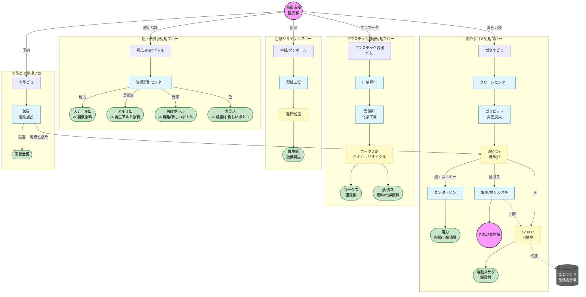

ゴミ袋を集積所に投げ入れたその瞬間、それは単に「消える」のではなく、精密機械、化学プロセス、そして厳しい環境基準によって構成された産業循環システムへと入っていきます。

「循環型社会」を実現するため、京都市は一連のハイテク手段を用いて廃棄物を処理しています。ここでは、様々な種類のゴミ処理プロセスのハードコアな内訳を紹介します。

## 京都の廃棄物処理プロセスフローチャート

---

## 燃やすゴミ：焼却から「溶融資源化」へ

京都市のクリーンセンター（南部、東北部クリーンセンターなど）は、単にゴミを「燃やす」だけではありません。実際には**火力発電所**であり、**鉱物製造工場**でもあります。

### ステップ1：負圧と脱臭

ゴミ収集車は巨大な**ゴミピット**にゴミを降ろします。臭気が外に漏れるのを防ぐため、ピット内部は**負圧**に保たれ、吸引された臭気は直接焼却炉に送られ、高温で完全に分解されます。

### ステップ2：850°C+ 高温完全燃焼

巨大なクレーンがゴミを掴み、**ストーカ式焼却炉**に投入します。

* **温度管理：** 炉内の温度は **850°C ~ 950°C** の間で厳密に管理されています。
* **目的：** この温度帯は、猛毒物質**ダイオキシン**の生成を最大限に抑制します。
* **廃熱利用：** 燃焼によって発生した熱エネルギーは水を加熱して高圧蒸気にし、蒸気タービンを回して発電します。京都市のクリーンセンターの年間発電量は、数万世帯分を賄うことができます。

### ステップ3：排ガス浄化（洗煙）

燃焼後の排ガスは非常に濁っており、多重の濾過を経る必要があります：

* **バグフィルター：** 巨大な掃除機のように微細な粉塵を吸着します。
* **洗煙塔：** 石灰スラリーと活性炭を噴霧し、酸性ガスを中和し、残留重金属を吸着します。

### ステップ4：灰を「宝石」に（溶融炉）

これが最も重要なステップです。燃焼後に残った**主灰**と濾過された**飛灰**は、**溶融炉**に送られます。

* **1200°C 超高温：** 極めて高い温度で、灰はマグマのような液体に溶かされます。
* **水冷固化：** 液体は水中に流れ込み瞬時に冷却され、黒いガラス砂のような粒状になり、**溶融スラグ**と呼ばれます。
* **用途：** この溶融スラグの体積は灰のわずか1/2で、非常に強固で無毒です。**舗装材、アスファルト混合物**、**コンクリート骨材**として広く使用されています。

---

## 瓶・缶・PETボトル：物理法則の究極の応用

資源ゴミ処理センターは、磁力、風力、光学を利用して自動選別を行う、まるで巨大な「物理実験室」のようです。

### ステップ1：破袋と不純物除去

まず、機械の刃がゴミ袋を切り開き、**風力選別機**が混入したビニール袋や軽い紙くずを吹き飛ばします。手作業のラインで、リサイクル不可能な異物（リチウム電池、ライターなど）を取り除きます。

### ステップ2：磁選機（磁力選別機）

強力な磁石を利用して、**スチール缶**を瞬時に吸い上げ、ベルトコンベア上の他の物品から分離します。

### ステップ3：アルミ選別機（渦電流選別機）

これは**渦電流**の原理を利用したブラックテクノロジーです。

* 機械は高周波で変化する磁場を発生させます。
* **アルミ缶**が通過すると、アルミ表面に渦電流が発生し、それによって反発磁場が生まれます。
* アルミ缶はまるで「弾き飛ばされる」ように、ベルトコンベアから専用の回収ボックスへと飛び込みます。

### ステップ4：光学選別（PETボトル用）

* **近赤外線センサー**がベルトコンベア上のボトルの材質をスキャンします。
* PET素材が特定されると、機械の末端にある**高圧エアノズル**が正確に気流を噴射し、PETボトルを回収ルートに吹き飛ばします。他のプラスチックボトルは自然に落下します。

---

## プラスチック：「ケミカルリサイクル」への移行

京都市で収集されたプラスチック製容器包装は、圧縮梱包された後、主に**ケミカルリサイクル**技術によって処理されます。これは日本でも比較的進んだ処理方法です。

### コア技術：コークス炉化学原料化

多くのプラスチックは製鉄所（新日鐵住金などのパートナー）に送られます。

* **原料投入：** 廃プラスチックは破砕され、製鉄用の**コークス炉**に投入されます。
* **無酸素熱分解：** 酸素を遮断した環境で加熱されます。
* **生成物：**
1. **コークス（40%）：** 製鉄の還元剤として使用。
2. **油（40%）：** 化学原料油になります。
3. **コークス炉ガス（20%）：** 発電用燃料として使用。

* **意義：** この方法は、本来必要だった石炭資源を廃プラスチックで代替し、炭素排出削減を実現しています。

---

## 最終処分場（埋立地）：終点ではなく「カプセル」

リサイクルも焼却もできないすべての残渣、および一部の焼却灰は、最終的に京都市の**エコランド音羽**（伏見区）に運ばれます。

これは単に穴を掘って埋めるのではなく、巨大な**環境隔離カプセル**です。

* **サンドイッチ構造：** 「ゴミ層＋覆土層」を交互に埋め立てる方式を採用し、ゴミの飛散や悪臭を防ぎます。
* **遮水層：** 底部には多層の高強度**遮水シート**が敷設されており、汚水が地下水や土壌に浸透するのを防ぎます。
* **浸出水処理：** 埋立地で発生した汚水（浸出水）はパイプを通じて集められ、専用の水処理プラントに送られます。生物処理と化学沈殿を経て、排出基準を満たすまで浄化されてから川に放流されます。

---

## なぜこれほど細かく分別するのか？

これらのプロセスを見れば、お分かりいただけるかもしれません：

1. **水分を切らないと：** 焼却炉が850°Cを維持するために、より多くの助燃燃料を噴射する必要があり、コストと二酸化炭素排出量が増加します。
2. **電池が混入すると：** 破砕機やゴミ収集車の中で押し潰されて発火し、高価な処理設備を焼失させる恐れがあります。
3. **ボトルを洗わないと：** 汚れの残留物がリサイクル設備を腐食させたり、再生材料の純度を下げたりして、ダウングレード処理（低品質な製品への転換）につながります。

**京都のすべての分別ゴミ箱は、あなたの家とこのハイテク環境保護工場をつなぐ出発点なのです。**

