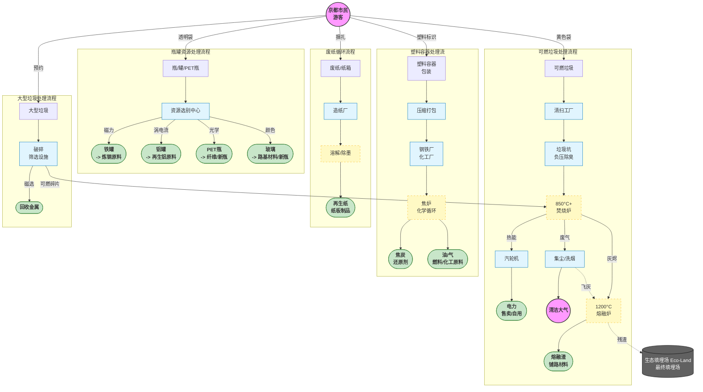

当我们把垃圾袋扔进集积所的那一刻，它并非仅仅“消失”了，而是进入了一个由精密机械、化学工艺和严格环保标准构成的工业循环系统。

为了实现“循环型社会”，京都市采用了一系列高科技手段来处理废弃物。以下是各类垃圾处理流程的硬核拆解。

## 京都垃圾处理全流程图

---

## 可燃垃圾：从焚烧到“熔融资源化”

京都市的清扫工厂（如南部、东北部清洁中心）并不仅仅是“烧掉”垃圾，它们实际上是**热能发电站**和**矿物制造厂**。

### 第一步：负压与除臭

垃圾车将垃圾卸入巨大的**垃圾坑（Pit）**。为了防止臭气外泄，垃圾坑内部保持**负压**状态，抽出的臭气被直接送入焚烧炉，在高温下分解殆尽。

### 第二步：850°C+ 高温完全燃烧

巨大的起重机将垃圾抓入**斯托克式焚烧炉**。

* **温度控制：** 炉内温度严格控制在 **850°C ~ 950°C** 之间。
* **目的：** 这个温度区间能最大程度地抑制剧毒物质**二恶英**的生成。
* **废热利用：** 燃烧产生的热能将水加热成高压蒸汽，推动汽轮机发电。京都市清扫工厂的年发电量可供约数万户家庭使用。

### 第三步：废气净化（洗烟）

燃烧后的烟气极其浑浊，必须经过多重过滤：

* **过滤集尘器（Bag Filter）：** 像巨大的吸尘器一样吸附细微粉尘。
* **洗烟塔：** 喷洒石灰浆和活性炭，中和酸性气体，并吸附残留的重金属。

### 第四步：灰烬变“宝石”（熔融炉）

这是最关键的一步。燃烧剩下的**灰烬（主灰）**和过滤下来的**飞灰**，会被送入**熔融炉**。

* **1200°C 超高温：** 在极高温度下，灰烬被熔化成岩浆状的液体。
* **水冷固化：** 液体流入水中瞬间冷却，变成像黑色玻璃砂一样的颗粒，称为**熔融渣（Slag）**。
* **用途：** 这些熔融渣体积只有灰烬的1/2，且非常坚固、无毒，被广泛用于**铺路材料、沥青混合料**和**混凝土骨料**。

---

## 瓶・罐・PET瓶（瓶罐）：物理定律的极致运用

资源垃圾处理中心就像一个巨大的“物理实验室”，利用磁力、风力和光学来自动分选。

### 第一步：破袋与除杂

首先，机器刀片划开垃圾袋，通过**风力选别机**吹走混入的塑料袋和轻质纸屑。人工流水线会剔除不可回收的异物（如锂电池、打火机）。

### 第二步：磁选机（磁力分选机）

利用强力磁铁，将**铁罐**瞬间吸起，与传送带上的其他物品分离。

### 第三步：铝选机（涡电流分选机）

这是利用**涡电流**原理的黑科技。

* 机器产生高频变化的磁场。
* 当**铝罐**通过时，铝表面产生涡电流，进而产生排斥磁场。
* 铝罐就像被“弹飞”一样，从传送带上跳入专门的回收箱。

### 第四步：光学选别（针对PET瓶）

* **近红外线传感器**扫描传送带上的瓶子材质。
* 一旦识别出PET材质，机器末端的**高压空气喷嘴**会精准地喷出一股气流，将PET瓶吹入回收通道，而其他塑料瓶则自然落下。

---

## 塑料：走向“化学循环”

京都市收集的塑料容器包装，经过压缩打包后，主要通过**化学回收**技术处理，这是日本较为先进的处理方式。

### 核心技术：焦炉化学原料化

很多塑料被送往钢铁厂（如新日铁住金等合作伙伴）。

* **原料投入：** 废塑料被切碎并投入炼钢用的**焦炉（Coke Oven）**。
* **无氧热解：** 在隔绝氧气的环境中加热。
* **产物：**
1. **焦炭（40%）：** 作为炼钢的还原剂使用。
2. **油（40%）：** 变成化工原料油。
3. **焦炉煤气（20%）：** 作为发电燃料。

* **意义：** 这种方式用废塑料替代了原本需要的煤炭资源，实现了碳减排。

---

## 最终处置场（填埋场）：并非终点，而是“胶囊”

所有无法回收且无法燃烧的残渣，以及部分焚烧灰，最终会来到京都市的**生态填埋场（Eco-Land）音羽**（位于伏见区）。

这不是简单的挖坑填埋，而是一个巨大的**环境隔离胶囊**。

* **三明治结构：** 采用“垃圾层 + 覆土层”交替掩埋的方式，防止垃圾飞散和恶臭。
* **防渗漏层：** 底部铺设了多层高强度的**遮水片（Sheet）**，防止脏水渗入地下水和土壤。
* **渗滤液处理：** 填埋场产生的污水（渗滤液）通过管道被收集起来，送往专门的水处理工厂，经过生物处理和化学沉淀，净化到达到排放标准后才排入河流。

---

## 为什么要分得这么细？

看完这些流程，您可能会明白：

1. **如果不沥干水分：** 焚烧炉为了维持850°C，就需要喷入更多助燃燃料，增加了成本和碳排放。
2. **如果混入电池：** 在破碎机或垃圾车中受挤压起火，会烧毁昂贵的处理设备。
3. **如果瓶子没洗净：** 脏污的残留物会腐蚀回收设备，降低再生材料的纯度，导致只能降级处理（变成低端产品）。

**京都的每一个分类垃圾桶，都是连接您家与这座高科技环保工厂的起点。**
